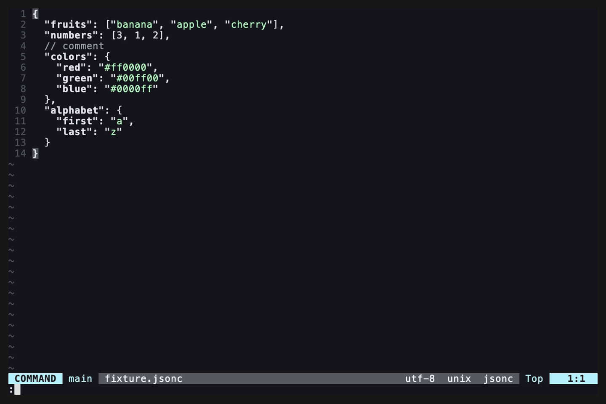

<div align="center">
<samp>

# sort-keys.nvim

Sorts object or table keys similar to the built-in sort command.

</samp>
</div>

> [!CAUTION]
> Please note that this is currently at an experimental stage. Breaking changes may occur.

## Demo



## Requirements

- Neovim 0.10 or newer
- A tree-sitter parser for whichever filetype you want to sort

## Installation

Using [lazy.nvim](https://github.com/folke/lazy.nvim):

```lua
{
  "airRnot1106/sort-keys.nvim",
  cmd = { "SortKeys", "DeepSortKeys" },
  opts = {},
}
```

Using [packer.nvim](https://github.com/wbthomason/packer.nvim):

```lua
use({
  "airRnot1106/sort-keys.nvim",
  config = function()
    require("sort-keys").setup({})
  end,
})
```

## Usage

| Command          | Effect                                                             |
| ---------------- | ------------------------------------------------------------------ |
| `:SortKeys`      | Sort the innermost container under the cursor (shallow).           |
| `:DeepSortKeys`  | Like `:SortKeys` but recurses into nested containers (post-order). |
| `:SortKeys!`     | Same as `:SortKeys` with the `!` flag (reverse order).             |
| `:'<,'>SortKeys` | Visual range — only entries inside the selection are reordered.    |

`:SortKeys` understands the same trailing flags as Vim's built-in `:sort`:

| Flag     | Meaning                                                                    |
| -------- | -------------------------------------------------------------------------- |
| `!`      | Reverse the comparison (descending).                                       |
| `i`      | Case-insensitive comparison.                                               |
| `n`      | Numeric comparison (`tonumber` both sides; falls back to string).          |
| `r/pat/` | Compare the substring matched by the Lua pattern `pat` (not the full key). |
| `u`      | Keep only the first occurrence per key (deduplicate).                      |

## Supported languages

See [`languages`](https://github.com/airRnot1106/sort-keys.nvim/tree/main/lua/sort-keys/parse/languages) for the full list of built-in languages.

## Documentation

See [`doc`](https://github.com/airRnot1106/sort-keys.nvim/tree/main/doc)

## Development

```sh
nix flake check                 # tests + lint + format
nix fmt                         # apply formatting in place
nix run .#default               # launch wrapped nvim with sort-keys.nvim + all bundled parsers
nix run .#dev                   # launch nvim that loads sort-keys.nvim from cwd (live edits)
nix run .#vhs                   # regenerate vhs/demo.gif from vhs/demo.tape
```

Run all specs without Nix:

```sh
nvim --headless --noplugin -u tests/minimal_init.lua \
  -c "PlenaryBustedDirectory tests/ { minimal_init = 'tests/minimal_init.lua' }"
```

## License

MIT
